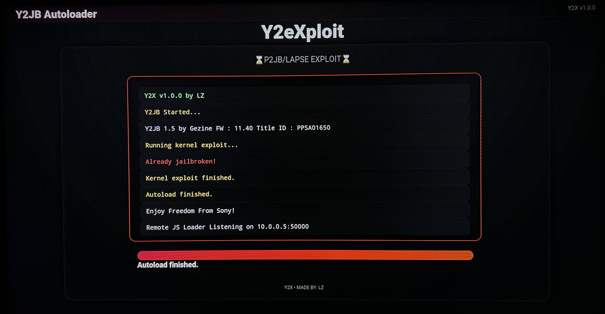

<h1 align="center">Y2eXploit (Y2X)</h1>

 

<h2 align="center">"PS5 Y2JB Autoloader"</h2>
<h3 align="center">Fork of <a href="https://github.com/Gezine/Y2JB">Y2JB</a></h3>
&nbsp;

Automatically loads the kernel exploit, elf_loader, your elf payloads, and .js scripts. Supports PS5 firmwares 4.03-12.40

 

---

## Overview

**Y2eXploit (Y2X)** is an autoloader with a clean ui designed to simplify and organize payload execution for Y2JB.

This particular fork of Y2JB is capable of autoloading **P2JB + Lapse**, autoupdating the Y2JB files from the usb with Y2JB_Updater, Autoloading Payload Manager, and it will Autoclose the YT App after it is finished loading.

---

## IMPORTANT
In "v1 Y2X" you can safely add KSTUFF to the autoload folder, as it will wait until YT is closed before autoloading any payloads.
- (Do Not Change The 5 Second Delay in the autoload.txt - "!5000" - it is there for stability)

### DON'T ADD KSTUFF IN THE PS5_AUTOLOADER FOLDER IN V2!
In "v2 Y2X" it will only autoload Payload Manager & FTP Server before closing the YT App because it will read from the "/mnt/sandbox/" folder.
If you attempt to add KSTUFF to this and rebuild it then that will cause Kernel Panic, so please do not add KSTUFF to the autoloader.
To avoid any issues just autoload KSTUFF from the Payload Manager for safety.
- YOU CAN NOT AUTOLOAD KSTUFF BEFORE CLOSING THE YT APP, IT WILL KP!

---

## Features

##### v1 Y2X - P2JB/Lapse + USB Autoloader  
- Autorun P2JB/Lapse Exploit
- Autoupdate Y2JB Files (From USB)
- Autoload Any ELF Files You Want (From USB)
- Autoclose YT App After Finish

##### v2 Y2X - P2JB/Lapse + Autoload PLDMGR & FTPSRV
- Autorun P2JB/Lapse Exploit
- Autoupdate Y2JB Files (From USB)
- Autoload Only Payload Manager & FTP Server Automatically
- Autoclose YT App After Finish

---

## Installation

### Retail
(I advise you to create a backup of your current PS5 before moving forward.)
- Download the backup file from [Releases Page](https://github.com/lz-anonz/Y2X/releases)
- Install it to an empty usb formatted to exFat
- Backup and Restore from USB
- Open the Y2JB app
- Wait ~50 Minutes
- Enjoy Freedom From Sony!

### Already Jailbroken
- Download the download0 file from [Releases Page](https://github.com/lz-anonz/Y2X/releases)
- Use a payload sender to load an ftpserver
- Open an FTP Manager like Filezilla and connect to the PS5 using (HOST:YOUR LOCAL PS5 IP ADDRESS & PORT:2121)
- Go to "user/download/PPSA01650/" on Filezilla
- Overwrite the download0 file with the one you downloaded here
---

## Project Purpose

This project was created to improve ui & payload execution in Y2JB.

---

## Credits & Acknowledgements

This project builds on the foundational work and research contributions from many developers in the PS5 security and homebrew community.

### Core Contributions

- **Gezine**  
  Creator of the Y2JB framework and foundational Lapse ecosystem work

- **itsPLK**  
  Contributions to autoloader ui concepts and payload structuring

- **Owendswang**  
  Contributions to Y2JB & Autoloader

- **TheFlow**  
  Low-level vulnerability research that enabled modern exploit development

- **EchoStretch / john-tornblom**  
  ELF loading tools, debugging utilities, and runtime execution research

- **PS5 Homebrew & Jailbreak Community**  
  Testing, validation, documentation, and continuous ecosystem support

---

## Disclaimer

This software is provided strictly for **educational and research purposes only**.

The developer does not promote or encourage piracy, system abuse, or unauthorized modification of commercial devices.

Users are fully responsible for compliance with applicable laws and regulations in their region.

No liability is assumed for damage, data loss, bans, or system instability.

---

## Contributing

Contributions, improvements, and suggestions are welcome.

To contribute:

1. Fork the repository  
2. Create a feature branch  
3. Commit your changes  
4. Submit a pull request  
