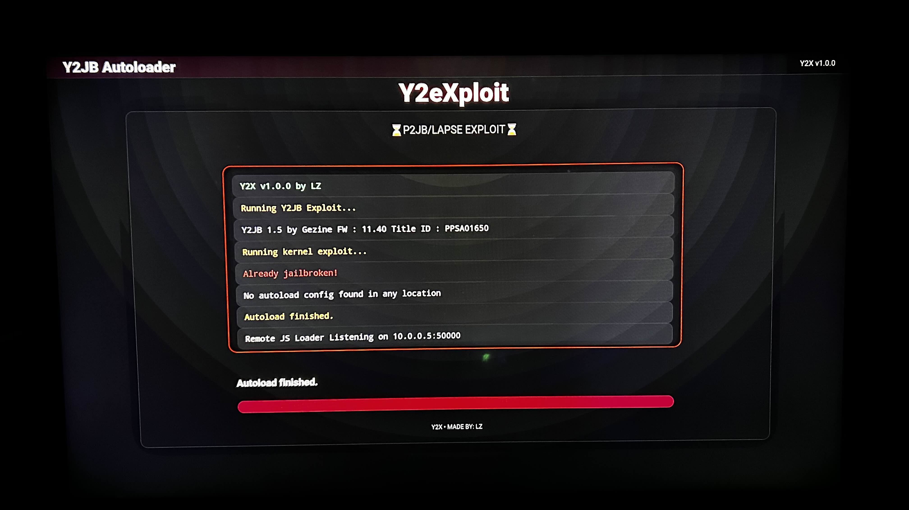

# Y2eXploit (Y2X)

---

## Overview

**Y2eXploit (Y2X)** is an autoloader designed to simplify and organize payload execution within the Y2JB ecosystem.

It provides a structured workflow for chaining and managing exploit-stage payloads including **P2JB + Lapse integration**.

---

## Features

- Y2JB Autoloader/Updater Included  
- Support for **Lapse Kernel Exploit**
- Support for **P2JB Kernel Exploit**  

---

## Screenshots

---

## Installation

### Download from Releases

---

## Project Purpose

This project was created to improve ui & payload execution in Y2JB.

---

## Credits & Acknowledgements

This project builds on the foundational work and research contributions from many developers in the PS5 security and homebrew community.

### Core Contributions

- **Gezine**  
  Creator of the Y2JB framework and foundational Lapse ecosystem work

- **itsPLK**  
  Contributions to autoloader ui concepts and payload structuring

- **Owendswang**  
  Contributions to Y2JB & Autoloader

- **TheFlow**  
  Low-level vulnerability research that enabled modern exploit development

- **EchoStretch / john-tornblom**  
  ELF loading tools, debugging utilities, and runtime execution research

- **PS5 Homebrew & Jailbreak Community**  
  Testing, validation, documentation, and continuous ecosystem support

---

## Disclaimer

This software is provided strictly for **educational and research purposes only**.

The developer does not promote or encourage piracy, system abuse, or unauthorized modification of commercial devices.

Users are fully responsible for compliance with applicable laws and regulations in their region.

No liability is assumed for damage, data loss, bans, or system instability.

---

## Contributing

Contributions, improvements, and suggestions are welcome.

To contribute:

1. Fork the repository  
2. Create a feature branch  
3. Commit your changes  
4. Submit a pull request  
